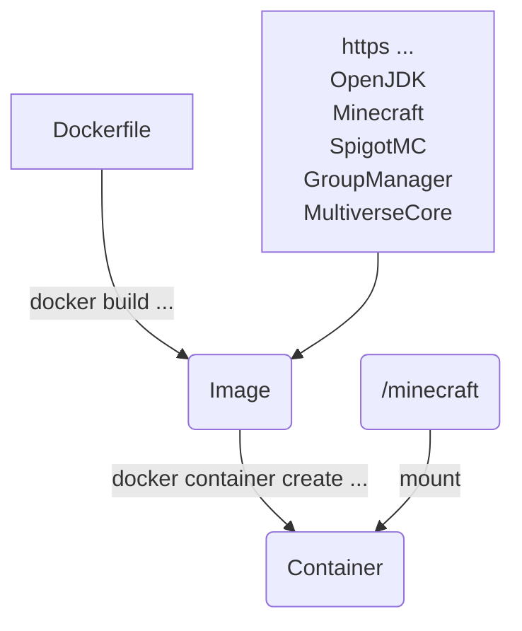

# MinecraftViaDocker

<div align="center">

[](https://www.minecraft.net/de-de/download/server "Currently supported server version and link to Minecraft")
[](https://github.com/Chris82111/SshBackupOfDocker "Link to SshBackupOfDocker")

</div>

The Dockerfile creates a container and downloads a Vanilla server and a Spiegot server. This is therefore an automation of the download. After starting the container:

- The internally created files are copied to a subfolder of the mounted folder (`apps/<version>`).
- The following four files are copied and existing files are overwritten:
  - The two plugin files `GroupManager.jar` and `MultiverseCore.jar`
  - The two server files `minecraft_server.jar` and `spigot.jar` are replaced.
- An additional `stdin.pipe` file for communication and a `startup.json` file are created.
- Other data is only copied if the folder is empty. With each start, the system checks whether the folder is empty and copies the data if necessary.

The Dockerfile can therefore be used to operate a server or to obtain only the necessary `*.jar` files.

A backup of a remote server can be created with the repository [SshBackupOfDocker](https://github.com/Chris82111/SshBackupOfDocker).

## Change Settings

Docker creates a configuration file `startup.json`. In this file, you can select Vanilla or Spigot (`.start.ifFalseThenVanillaElseSpigot`) and additional Java start parameters (`.java.param`).

## Using Docker

After cloning the repository or downloading the Dockerfile, the image and the container must be created.

Command to create the image (the creation takes about 215 seconds):

```sh
docker build --build-arg="JAVA_PARAMETER=-Xmx1024M -Xms1024M" --build-arg="START_SPIGOT=false" -t minecraft_via_docker:1.21.8 .
```

Command to create the container without executing it:

```sh
docker container create -it --restart always --name mcContainer -p 25565:25565 --mount type=bind,source="$(pwd)"/minecraft,target=/minecraft --env EULA=true minecraft_via_docker:1.21.8 sh
```

Start:

```sh
docker start mcContainer
```

Stop, stopping the container sends the correct command to the app so that the app saves all data and shuts down:

```sh
docker stop mcContainer
```

Commands can be sent directly from the host system to the application in the container.
Under Linux you can use the following command or the Windows command:

```sh
docker exec mcContainer /bin/sh -c 'echo "/say hello" >> stdin.pipe'
```

Under Windows you can use the following command:

```ps1
docker exec mcContainer /bin/sh -c "echo '/say hello' >> stdin.pipe"
```

Connect to a running container to execute commands:

```sh
docker exec -it mcContainer sh
```

Remove

```sh
docker stop mcContainer ; docker remove mcContainer
```

## Update an Old version

1. Check the current container:

    ```sh
    docker ps --all
    ```

2. Stop current container:

    ```sh
    docker stop mcContainer
    ```

3. You need to create a backup of your world!

4. Removing the old container:

    ```sh
    docker remove mcContainer
    ```

5. Pull latest repository data:

    ```sh
    git pull
    ```

6. Create the image:

    ```sh
    docker build --build-arg="JAVA_PARAMETER=-Xmx1024M -Xms1024M" --build-arg="START_SPIGOT=false" -t minecraft_via_docker:1.21.8 .
    ```

7. Create the container:

    ```sh
    docker container create -it --restart always --name mcContainer -p 25565:25565 --mount type=bind,source="$(pwd)"/minecraft,target=/minecraft --env EULA=true minecraft_via_docker:1.21.8 sh
    ```

8. Start container:

    ```sh
    docker start mcContainer
    ```

## Overview



## Terms

All data contained in this Dockerfile, including without limitation e.g. source code, programs, applications have their own terms and must be respected. The "Unlicense license" refers to the GitHub repository and the Dockerfile but not to the data downloaded in the container.
